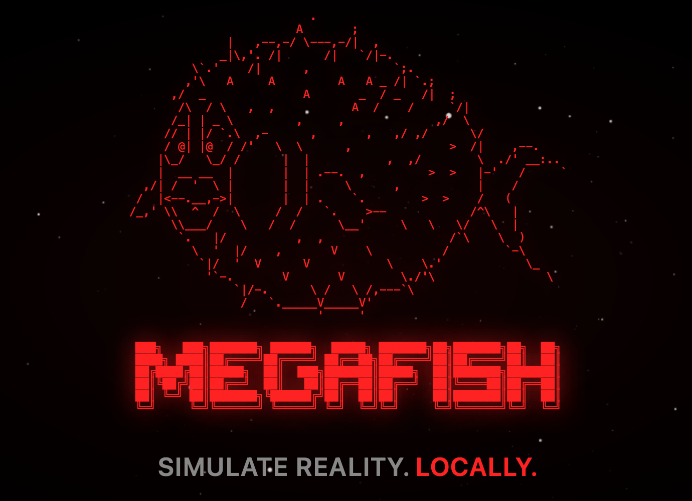
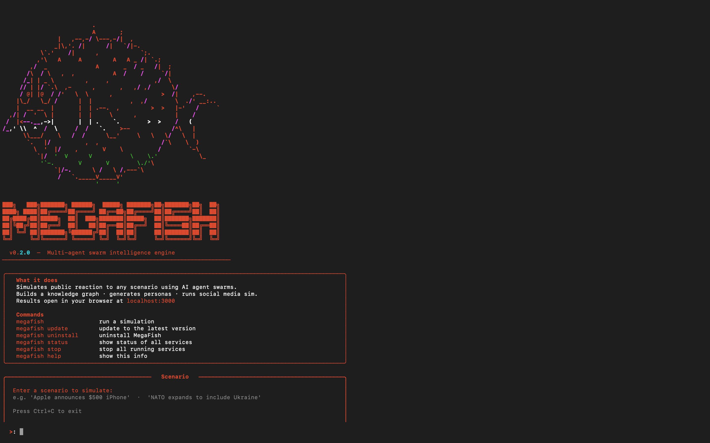

<div align="center">



# MegaFish

**Fully local multi-agent social simulation — no cloud APIs required. English UI.**

*Upload a document. Watch hundreds of AI agents argue about it on the internet.*

[](https://github.com/Inventor-ai-god/MegaFish/stargazers)
[](https://github.com/Inventor-ai-god/MegaFish/network)
[](./LICENSE)

</div>

## Install

**macOS / Linux**
```bash
curl -fsSL https://raw.githubusercontent.com/Inventor-ai-god/MegaFish/main/install.sh | bash
```

**Windows (PowerShell — run as Administrator)**
```powershell
irm https://raw.githubusercontent.com/Inventor-ai-god/MegaFish/main/install.ps1 | iex
```

Then run:
```bash
megafish
```

## What is this?

MegaFish is a multi-agent simulation engine: upload any document (press release, policy draft, financial report), and it generates hundreds of AI agents with unique personalities that simulate the public reaction on social media. Posts, arguments, opinion shifts — hour by hour.

Everything runs on your machine. No cloud API keys. No data leaving your hardware.

This is a fork of [the original MegaFish](https://github.com/666ghj/MegaFish) (Chinese market, cloud APIs) rebuilt to be **fully local and fully English**:

| Original MegaFish | This fork |
|---|---|
| Chinese UI | **English UI** (1,000+ strings translated) |
| Zep Cloud (graph memory) | **Neo4j Community Edition 5.18** |
| DashScope / OpenAI API | **Ollama** (qwen2.5, llama3, etc.) |
| Cloud API keys required | **Zero cloud dependencies** |

## Workflow

1. **Graph Build** — Extracts entities (people, companies, events) and relationships from your document. Builds a knowledge graph with memory via Neo4j.
2. **Env Setup** — Generates hundreds of agent personas, each with unique personality, opinion bias, reaction speed, influence level, and memory of past events.
3. **Simulation** — Agents interact on simulated social platforms: posting, replying, arguing, shifting opinions. Tracks sentiment evolution, topic propagation, and influence dynamics in real time.
4. **Report** — A ReportAgent analyzes the simulation, interviews focus groups of agents, searches the knowledge graph for evidence, and generates a structured analysis.
5. **Interaction** — Chat with any agent from the simulated world. Ask them why they posted what they posted. Full memory and personality persists.

## How it works

When you run `megafish "your scenario"`, here's what happens under the hood:

**Step 1 — Ontology Generation**
The LLM reads your scenario and designs a social map: which types of people exist in this world (`TechJournalist`, `Consumer`, `Competitor`) and how they relate (`REPORTS_ON`, `COMPETES_WITH`). This blueprint — the *ontology* — defines the rules of the simulated world.
> *Fix: context window raised from 2,048 → 8,192 tokens and output limit from 1,200 → 4,096 to stop the LLM cutting off mid-JSON.*

**Step 2 — Knowledge Graph Build**
Populates the ontology with real entities extracted from your document: nodes like `Apple Inc`, `Tim Cook`, `Samsung`; edges like `Tim Cook → WORKS_FOR → Apple Inc`. This is the world agents will live in (stored in Neo4j).

**Step 3 — Create Simulation**
Reserves a simulation slot with a unique ID (`sim_xxxx`). No agents yet — just a placeholder.

**Step 4 — Generate Agent Personas**
For every entity in the knowledge graph, the LLM generates a fake social-media profile: name, personality, political lean, writing style, posting habits. Profiles are saved as `reddit_profiles.json` and `twitter_profiles.csv`. 20 entities = 20 LLM calls.
> *Fix: this step was never being called — the CLI was jumping straight from "Create Simulation" to "done". Now correctly wired in.*

**Step 5 — Run Simulation**
Launches a background process. Agents read the scenario and start posting on fake Twitter/Reddit — replying, retweeting, upvoting, shifting opinions. Each round = a chunk of simulated time. Actions are streamed to `actions.jsonl` in real time.

**Step 6 — Poll Progress**
The CLI watches progress (`● Sim: round 3/10`) until all rounds finish.

**Step 7 — Generate Report**
The LLM reads all agent actions and writes a structured report: overall public sentiment, key narratives that emerged, which groups drove the conversation, and how opinion evolved over time.

**Step 8 — Open Browser**
Opens `localhost:3000/report/report_xxxx` — the full visual report in the frontend.

---

MegaFish is a **terminal-first app**. One command installs everything and it runs 100% locally — no data ever leaves your machine:

```bash
curl -fsSL https://raw.githubusercontent.com/Inventor-ai-god/MegaFish/main/install.sh | bash
```

## Screenshot

<div align="center">

</div>

## MegaFish vs MiroFish — what's different

MiroFish-Offline was a good first step at making MegaFish run locally. MegaFish builds on it and fixes the things that were actually broken:

| | MiroFish-Offline | **MegaFish** |
|---|---|---|
| **Install** | Manual — clone repo, install deps, start services by hand | `curl \| bash` — one command, done |
| **CLI** | `megafish status` / `megafish stop` accidentally triggered a simulation instead of running the command | Fixed — all subcommands route correctly |
| **Backend startup** | Silent failure after 30 s timeout; CLI crashed with a raw `ReadTimeout` | Shows last 10 lines of startup log + exits cleanly with a clear error |
| **Port conflicts** | A stale backend process on port 5001 would silently block every future run | Auto-detects and kills the stale process before starting |
| **Ontology generation** | LLM cut off mid-JSON because context window (2,048 tokens) was too small | Context window raised to 8,192 / output limit to 4,096 — no more truncated JSON |
| **Agent persona generation** | Step was wired up in the backend but **never called by the CLI** — simulations ran with zero personas | Fixed — CLI now correctly calls prepare_simulation before starting |
| **UI** | Startup screen panels stretched full-width with no structure | Fish art centered as a rigid block; clean info panel; scenario box with no redundant bottom border |

The short version: MiroFish-Offline could install and display the UI. MegaFish can actually **run a simulation end-to-end**.

## Manual Install

### Prerequisites

- Docker & Docker Compose (recommended), **or**
- Python 3.11+, Node.js 18+, Neo4j 5.18+, Ollama

### Option A: Docker (easiest)

```bash
git clone https://github.com/ps3gamingcoolMvp/MegaFish.git
cd MegaFish
cp .env.example .env

# Start all services (Neo4j, Ollama, MegaFish)
docker compose up -d

# Pull the required models into Ollama
docker exec megafish-ollama ollama pull qwen2.5:32b
docker exec megafish-ollama ollama pull nomic-embed-text
```

Open `http://localhost:3000` — that's it.

### Option B: Manual

**1. Start Neo4j**

```bash
docker run -d --name neo4j \
  -p 7474:7474 -p 7687:7687 \
  -e NEO4J_AUTH=neo4j/megafish \
  neo4j:5.18-community
```

**2. Start Ollama & pull models**

```bash
ollama serve &
ollama pull qwen2.5:32b      # LLM (or qwen2.5:14b for less VRAM)
ollama pull nomic-embed-text  # Embeddings (768d)
```

**3. Configure & run backend**

```bash
cp .env.example .env
# Edit .env if your Neo4j/Ollama are on non-default ports

cd backend
pip install -r requirements.txt
python run.py
```

**4. Run frontend**

```bash
cd frontend
npm install
npm run dev
```

Open `http://localhost:3000`.

## CLI

The bootstrap installer adds a `megafish` command:

```
megafish           — start MegaFish
megafish stop      — stop all services
megafish status    — check service health
megafish update    — pull latest version
megafish uninstall — remove MegaFish
megafish help      — show commands
```

## Configuration

All settings are in `.env` (copy from `.env.example`):

```bash
# LLM — points to local Ollama (OpenAI-compatible API)
LLM_API_KEY=ollama
LLM_BASE_URL=http://localhost:11434/v1
LLM_MODEL_NAME=qwen2.5:32b

# Neo4j
NEO4J_URI=bolt://localhost:7687
NEO4J_USER=neo4j
NEO4J_PASSWORD=megafish

# Embeddings
EMBEDDING_MODEL=nomic-embed-text
EMBEDDING_BASE_URL=http://localhost:11434
```

Works with any OpenAI-compatible API — swap Ollama for Claude, GPT, or any other provider by changing `LLM_BASE_URL` and `LLM_API_KEY`.

## Architecture

```
┌─────────────────────────────────────────┐
│              Flask API                   │
│  graph.py  simulation.py  report.py     │
└──────────────┬──────────────────────────┘
               │ app.extensions['neo4j_storage']
┌──────────────▼──────────────────────────┐
│           Service Layer                  │
│  EntityReader  GraphToolsService         │
│  GraphMemoryUpdater  ReportAgent         │
└──────────────┬──────────────────────────┘
               │ storage: GraphStorage
┌──────────────▼──────────────────────────┐
│         GraphStorage (abstract)          │
│              │                            │
│    ┌─────────▼─────────┐                │
│    │   Neo4jStorage     │                │
│    │  ┌───────────────┐ │                │
│    │  │ EmbeddingService│ ← Ollama       │
│    │  │ NERExtractor   │ ← Ollama LLM   │
│    │  │ SearchService  │ ← Hybrid search │
│    │  └───────────────┘ │                │
│    └───────────────────┘                │
└─────────────────────────────────────────┘
               │
        ┌──────▼──────┐
        │  Neo4j CE   │
        │  5.18       │
        └─────────────┘
```

- `GraphStorage` is an abstract interface — swap Neo4j for any graph DB by implementing one class
- Dependency injection via Flask `app.extensions` — no global singletons
- Hybrid search: 0.7 × vector similarity + 0.3 × BM25 keyword search

## Hardware Requirements

| Component | Minimum | Recommended |
|---|---|---|
| RAM | 16 GB | 32 GB |
| VRAM (GPU) | 10 GB (14b model) | 24 GB (32b model) |
| Disk | 20 GB | 50 GB |
| CPU | 4 cores | 8+ cores |

CPU-only mode works but is significantly slower. For lighter setups, use `qwen2.5:14b` or `qwen2.5:7b`.

## Use Cases

- **PR crisis testing** — simulate the public reaction to a press release before publishing
- **Trading signal generation** — feed financial news and observe simulated market sentiment
- **Policy impact analysis** — test draft regulations against simulated public response
- **Creative experiments** — someone fed it a classical Chinese novel with a lost ending; the agents wrote a narratively consistent conclusion

## License

AGPL-3.0 — same as the original MegaFish project. See [LICENSE](./LICENSE).

## Credits & Attribution

Fork of [MegaFish](https://github.com/666ghj/MegaFish) by [666ghj](https://github.com/666ghj), originally supported by [Shanda Group](https://www.shanda.com/). Simulation engine powered by [OASIS](https://github.com/camel-ai/oasis) from the CAMEL-AI team.

**Changes in this fork:**
- Backend migrated from Zep Cloud to local Neo4j CE 5.18 + Ollama
- Entire frontend translated from Chinese to English (20 files, 1,000+ strings)
- Bootstrap installer (`megafish` CLI) for macOS, Linux, and Windows
- All Zep references replaced with Neo4j across UI and backend
